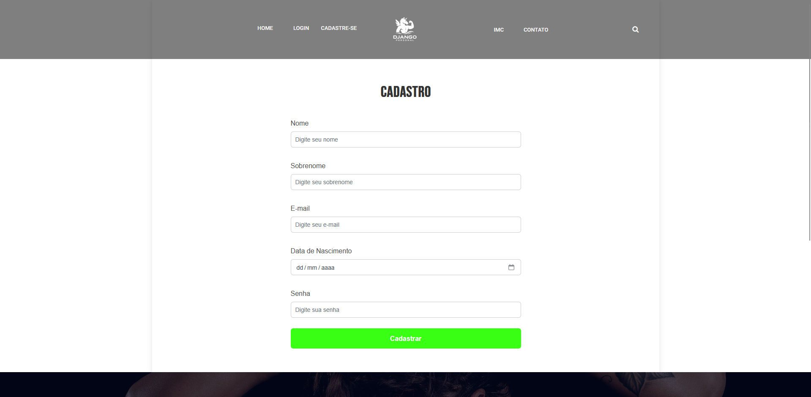
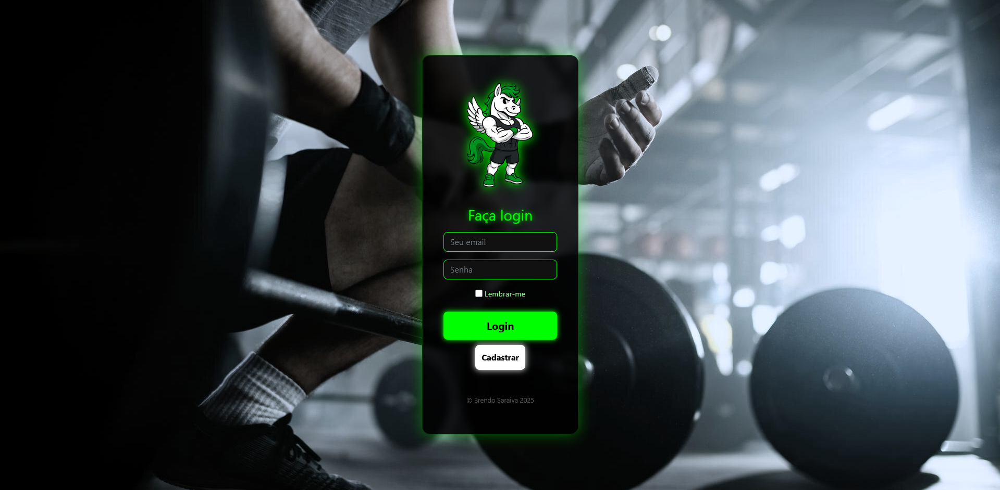
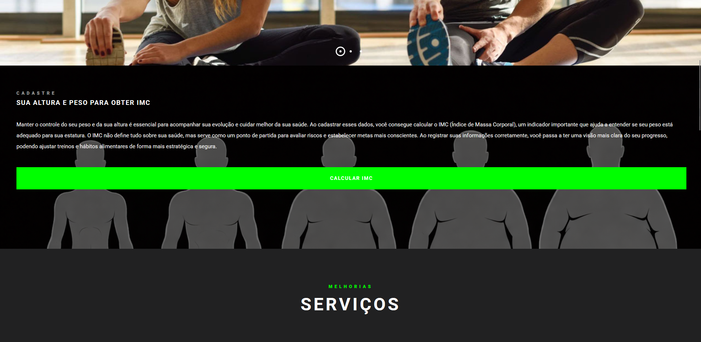
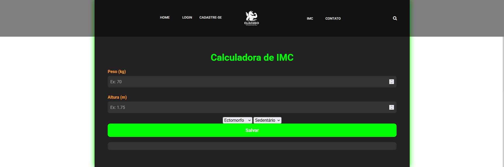
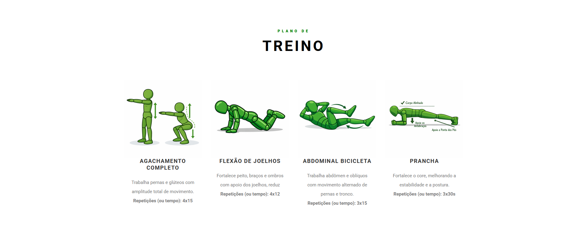
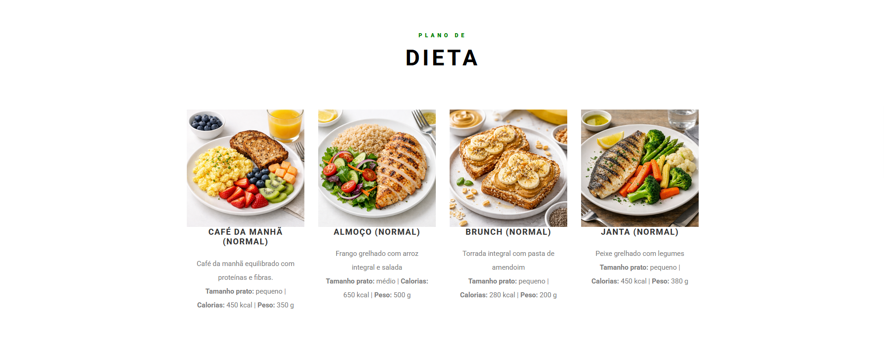

<div align="center">
    
</div>

# Django Personal

------------------------------------------------------------------------------------------------------------------------
### Português (pt-br)

## Descrição
O foco desse sistema é fornecer ao usuário exercícios de acordo com o seu <b>Índice de Massa Corporal (IMC)</b> para
treinar em casa. É apresentado para o usuário imagens com atividades de calistenia, onde o foco é somente usar o peso do
próprio corpo para ganhar massa ou perder gordura.

O projeto também mostra um plano de dieta alimentar com a mesma abordagem acima, mas com o foco em mudanças nos hábtos 
alimentares.

## Status do projeto
<b>(Em desenvolvimento)</b>

## Funcionalidades
* 🔐 Sistema de autenticação de usuários comum/administrador;
* 🎨 Uso do bootstrap para melhorar o visual do projeto;
* ⚖️ Sistema de Recomendação Dinâmica: O site não apenas calcula o IMC, mas atua como um assistente pessoal, filtrando
uma base de exercícios específicos para o perfil metabólico do usuário.
* 🏃 Categorização de Treinos: Implementação de lógica condicional que separa exercícios de alto impacto (para faixas de
peso normal) de treinos de baixo impacto/mobilidade (para faixas de sobrepeso), focando na segurança das articulações.

## Tecnologias Utilizadas


## Como Executar o Projeto (Pré-requisitos e Instalação)
Para rodar este projeto localmente, é necessário criar um ambiente virtual e instalar as dependências do sistema.
**O projeto utiliza:**

* Django (framework principal)
* Whitenoise (gerenciamento de arquivos estáticos em produção)
* Gunicorn (servidor WSGI para ambientes de produção)
* Stdimage (processamento e redimensionamento de imagens)
* Bootstrap4 (estilização do frontend)

⚠️ Observação: O Django possui um servidor embutido destinado apenas para desenvolvimento.
Em ambiente de produção, recomenda-se utilizar um servidor WSGI como o Gunicorn.

### 📦 <i>Instalação do projeto</i> 
````
git clone https://github.com/brendosaraiva/DjangoPersonal
cd DjangoPersonal

python -m venv venv

# Windows
venv/Scripts/activate

# Linux / Mac
source venv/bin/activate

pip install -r requirements.txt

# Criando projeto
django-admin startproject django_personal

# Criando aplicação
django-admin startapp core

# Criando arquivos de migrations + tabelas
Não precisa, o banco de dados está criado e as migrations também. Fica a cargo de você
mudá-las de acordo com a suas necessidades

# Inicia o servidor em desenvolvimento
python manage.py runserver
````

#### 📄 <i>Gerando arquivo requirements.txt</i>

Depois da configuração acima feita, o projeto estará apto para realizar testes.
````
pip freeze > requirements.txt
````

Depois de feito o deploy, caso queira acrescentar novos recursos, você deve executar o seguinte comando:
````
pip install -r requirements.txt
````

O arquivo requirements.txt é lido pelo pip (ou pela plataforma de hospedagem).

#### ⚙️ <i>Configuração do settings.py</i>

Caso crie seu próprio projeto Django, será necessário configurar corretamente o arquivo settings.py.
<b>Certifique-se de</b>:
* Adicionar as aplicações necessárias em INSTALLED_APPS
* Configurar corretamente STATIC_URL, MEDIA_URL, STATIC_ROOT e MEDIA_ROOT
* Definir o modelo de usuário personalizado (AUTH_USER_MODEL)
* Configurar redirecionamentos de autenticação
* Definir DEBUG = False em produção
* Configurar corretamente ALLOWED_HOSTS no ambiente de deploy

### <i>requirements.txt</i>
Quando for colocar o projeto para produção (realizar o deploy), será necessário ter um arquivo chamado requirements.txt
dentro, pois o gunicorn irá varrer o arquivo e verificar as dependências instaladas.
````
pip freeze > requirements.txt
````

### <i>settings.py e projeto</i>
Será necessário que gere seu próprio projeto para obtenção do seu arquivo de <b>settings.py</b>, copie e cole
abaixo da constante <b>"ALLOWED_HOSTS", substituindo</b> somente os scripts abaixo dela.

Exemplo:

* Aplicações obrigatórias são adicionadas ao INSTALLED_APPS
* Arquivos estáticos e de mídia estão corretamente configurados (STATIC_URL, MEDIA_URL, STATIC_ROOT, MEDIA_ROOT)
* O modelo de usuário customizado está definido (AUTH_USER_MODEL)
* URLs de redirecionamento de autenticação estão configuradas corretamente
* DEBUG = False em produção
* ALLOWED_HOSTS está corretamente configurado para o deploy

````
"""
Insira dentro do seu arquivo de settings.py (gerado automaticamente), abaixo da constante "ALLOWED_HOSTS = ["*"]" ao criar o projeto
"""

# Se subir o projeto para web, desmarque "whitenoise.middleware.WhiteNoiseMiddleware" para servir os arquivos estáticos.
INSTALLED_APPS = [
    "django.contrib.admin",
    # "whitenoise.middleware.WhiteNoiseMiddleware",
    "django.contrib.auth",
    "django.contrib.contenttypes",
    "django.contrib.sessions",
    "django.contrib.messages",
    "django.contrib.staticfiles",
    "core",
    "bootstrap4",
    "stdimage",
]

MIDDLEWARE = [
    "django.middleware.security.SecurityMiddleware",
    # "whitenoise.middleware.WhiteNoiseMiddleware",  -> Serve arquivos estáticos quando estiver produção.
    "django.contrib.sessions.middleware.SessionMiddleware",
    "django.middleware.common.CommonMiddleware",
    "django.middleware.csrf.CsrfViewMiddleware",
    "django.contrib.auth.middleware.AuthenticationMiddleware",
    "django.contrib.messages.middleware.MessageMiddleware",
    "django.middleware.clickjacking.XFrameOptionsMiddleware",
]

ROOT_URLCONF = "django_personal.urls"

TEMPLATES = [
    {
        "BACKEND": "django.template.backends.django.DjangoTemplates",
        "DIRS": ["templates"],
        "APP_DIRS": True,
        "OPTIONS": {
            "context_processors": [
                "django.template.context_processors.request",
                "django.contrib.auth.context_processors.auth",
                "django.contrib.messages.context_processors.messages",
            ],
        },
    },
]

WSGI_APPLICATION = "django_personal.wsgi.application"


# Database
# https://docs.djangoproject.com/en/5.2/ref/settings/#databases

DATABASES = {
    "default": {
        "ENGINE": "django.db.backends.sqlite3",
        "NAME": BASE_DIR / "djangopersonal.sqlite3",
    }
}


# Password validation
# https://docs.djangoproject.com/en/5.2/ref/settings/#auth-password-validators

AUTH_PASSWORD_VALIDATORS = [
    {
        "NAME": "django.contrib.auth.password_validation.UserAttributeSimilarityValidator",
    },
    {
        "NAME": "django.contrib.auth.password_validation.MinimumLengthValidator",
    },
    {
        "NAME": "django.contrib.auth.password_validation.CommonPasswordValidator",
    },
    {
        "NAME": "django.contrib.auth.password_validation.NumericPasswordValidator",
    },
]


# Internationalization
# https://docs.djangoproject.com/en/5.2/topics/i18n/

LANGUAGE_CODE = "pt-br"

TIME_ZONE = "America/Porto_Velho"

USE_I18N = True

USE_TZ = True


# Static files (CSS, JavaScript, Images)
# https://docs.djangoproject.com/en/5.2/howto/static-files/

STATIC_URL = "static/"
MEDIA_URL = "/media/"
STATIC_ROOT = os.path.join(BASE_DIR, "staticfiles")
MEDIA_ROOT = os.path.join(BASE_DIR, "media")

AUTH_USER_MODEL = 'core.CustomUsuario'

# Default primary key field type
# https://docs.djangoproject.com/en/5.2/ref/settings/#default-auto-field

DEFAULT_AUTO_FIELD = "django.db.models.BigAutoField"

# Configurações de e-mail
EMAIL_BACKEND = 'django.core.mail.backends.console.EmailBackend'


# REDIRECIONANDO OS USUÁRIOS
LOGIN_URL = reverse_lazy("login")
LOGIN_REDIRECT_URL = reverse_lazy("index")
LOGOUT_REDIRECT_URL = reverse_lazy("login")

````

## Funcionamento do sistema

Visualizando o funcionamento e a lógica de negócio do sistema.


* ### Login
Para construção, foi utilizado dois tipos de usuários: o primeiro é oriundo do próprio django na qual
representa os usuários que gerenciam o sistema e o segundo é para usuários comuns, exemplo:

<b>models.py</b>
````
from django.contrib.auth.models import AbstractUser, BaseUserManager
````

* ### Cadastro



No arquivo de views, tem docstrings explicativas da lógica referente a página de cadastro. Os dados
fornecidos no formulário de cadastro são: nome, sobrenome, e-mail, senha e data de nascimento. Ambos
os campos devem concordar com os atributos no template de cadastro. Essa página é responsável por
realizar cadastro.

Ambas bibliotecas são usadas na construção e persistência dos dados do usuário. O BaseUserManager é utilizado
para customizar o usuário manager, enquanto AbstractUser é usado para customização de usuário comum.



* ### Index - Usuários cadastrados

|  |  |
|:----------------------------------------------------:|:----------------------------------------------------:|

Nessa view possuí duas condicionais que separam os usuários não autenticados dos que possuem cadastro
no sistema. Os visitantes irão saber os objetivos do sistema, enquanto os <b>logados existem dois tipos</b>,
com dados de biotipo físico cadastrado ou não. Os não cadastrados irão ver uma seção na página raiz que pede
para que forneçam seus dados físicos na página <b>"imc"</b>, enquanto os com biotipo cadastrados irão visualizar
até 4 tipos de exercícios físicos e de dieta.

OBS: os dados de biotipos, são dados que serão pedidos pelo sistema após o usuário realizar o cadastro no site.
Esses dados pertencerão a um modelo que é uma entidade ligada a CustomUsuario, chamada BiotipoUsuario (consultar
models.py para melhor entendimento).

* ### Treino e dieta

|  |  |
|:----------------------------------------:|:--------------------------------------:|

Com os dados extras fornecidos, o sistema fornecerá 4 treinos conform a faixa de Índice de Massa Corporal (IMC)
e 4 refeições para dieta. Ambos serão apresentados de acordo ao atual momento físico da pessoa e ritmo de treino
respeitando as limitações de cada um.


## Contribuição
Caso tenha sugestões para aprimorar o sistema, sinta-se à vontade para realizar os ajustes necessários.

### Licença MIT
* <b>Utilização:</b> sistema pode ser usado para qualquer finalidade;
* <b>Copiar:</b> fazer cópias livremente;
* <b>Modificar:</b> Alterar o código-fonte original.
* <b>Fundir/Incorporar:</b> Mesclar com outros programas.
* <b>Publicar/Distribuir:</b> Compartilhar o código.
* <b>Sublicenciar:</b> Passar o código para outros sob licenças diferentes.
* <b>Vender:</b> Comercializar cópias do software, inclusive incluí-lo em produtos proprietários.


Copyright (c) [2026] [BRENDO SARAIVA]
É concedida permissão, gratuitamente, a qualquer pessoa que obtenha uma cópia deste software e dos arquivos de
documentação associados, para lidar com o Software sem restrição, incluindo, sem limitação, os direitos de usar, copiar,
modificar, mesclar, publicar, distribuir, sublicenciar e/ou vender cópias do Software, e permitir que as pessoas a quem
o Software é fornecido o façam, mediante as seguintes condições:
O aviso de copyright acima e este aviso de permissão devem ser incluídos em todas as cópias ou partes substanciais do
Software.

O SOFTWARE É FORNECIDO "COMO ESTÁ", SEM GARANTIA DE QUALQUER TIPO, EXPRESSA OU IMPLÍCITA, INCLUINDO, MAS NÃO SE LIMITANDO
ÀS GARANTIAS DE COMERCIALIZAÇÃO, ADEQUAÇÃO A UM DETERMINADO FIM E NÃO INFRAÇÃO. EM NENHUM CASO OS AUTORES OU TITULARES DE
DIREITOS AUTORAIS SERÃO RESPONSÁVEIS POR QUALQUER RECLAMAÇÃO, DANOS OU OUTRA RESPONSABILIDADE, SEJA EM AÇÃO DE CONTRATO,
DELITO OU DE OUTRA FORMA, DECORRENTE DE, FORA DE OU EM CONEXÃO COM O SOFTWARE OU O USO OU OUTRAS NEGOCIAÇÕES NO SOFTWARE.

------------------------------------------------------------------------------------------------------------------------

### English (en-us)

## Description

The focus of this system is to provide users with exercises according to their Body Mass Index (BMI) to train at home.
The user is presented with images of calisthenics activities, where the focus is exclusively on using body weight to
gain muscle mass or lose fat.

The project also includes a diet plan following the same approach, but focused on changing eating habits.

## Project Status
(In development)

## Features
* 🔐 **User Authentication System** (regular user / administrator);
* 🎨 **Use of Bootstrap** to enhance the project's visual design;
* ⚖️ **Dynamic Recommendation System:** The website not only calculates BMI, but also acts as a personal assistant,
filtering a database of exercises tailored to the user’s metabolic profile;
* 🏃 **Workout Categorization:** Implementation of conditional logic that separates high-impact exercises (for normal
weight ranges) from low-impact/mobility workouts (for overweight ranges), prioritizing joint safety.


## Technologies Used


## How to Run the Project (Prerequisites and Installation)

To run this project locally, you must create a virtual environment and install the required dependencies.
**This project uses:**

* Django (main framework)
* Whitenoise (static file handling in production)
* Gunicorn (WSGI server for production environments)
* Stdimage (image processing and resizing)
* Bootstrap4 (frontend styling integration)

⚠️ Note: Django includes a built-in development server intended for development only.
In production environments, it is recommended to use a WSGI server such as Gunicorn.

#### <i>Project Installation</i>
````
git clone https://github.com/brendosaraiva/DjangoPersonal
cd DjangoPersonal

python -m venv venv

# Windows
venv/Scripts/activate

# Linux / Mac
source venv/bin/activate

pip install -r requirements.txt

# Creating the project
django-admin startproject django_personal

# Creating the application
django-admin startapp core

# Creating migration files + tables
Not required — the database and migrations are already created. It is up to you
to modify them according to your needs.

# Start development server
python manage.py runserver
````

After completing the configuration above, the project will be available at:

````
http://127.0.0.1:8000/
````

#### 📄 <i>Generating requirements.txt</i>

Before deploying the project, it is recommended to generate a requirements.txt file containing all installed dependencies:
````
pip freeze > requirements.txt
````

In the production environment, install dependencies using:
````
pip install -r requirements.txt
````

The requirements.txt file is read by pip (or by the hosting platform during deployment).

#### ⚙️ <i>settings.py Configuration</i>

It will be necessary to generate your own project in order to obtain your <b>settings.py</b> file. Copy and paste the content below the constant **<b>"ALLOWED_HOSTS", replacing</b> only the scripts below it.

Example:

* Required applications are added to INSTALLED_APPS
* Static and media files are correctly configured (STATIC_URL, MEDIA_URL, STATIC_ROOT, MEDIA_ROOT)
* The custom user model is defined (AUTH_USER_MODEL)
* Authentication redirect URLs are properly configured
* DEBUG = False in production
* ALLOWED_HOSTS is correctly set for deployment

Example configuration:

````
"""
Insert inside your settings.py file (automatically generated), below the constant "ALLOWED_HOSTS = ["*"]" when creating the project
"""

# If you deploy the project to the web, uncomment "whitenoise.middleware.WhiteNoiseMiddleware" to serve static files.
INSTALLED_APPS = [
    "django.contrib.admin",
    # "whitenoise.middleware.WhiteNoiseMiddleware",
    "django.contrib.auth",
    "django.contrib.contenttypes",
    "django.contrib.sessions",
    "django.contrib.messages",
    "django.contrib.staticfiles",
    "core",
    "bootstrap4",
    "stdimage",
]

MIDDLEWARE = [
    "django.middleware.security.SecurityMiddleware",
    # "whitenoise.middleware.WhiteNoiseMiddleware",  -> Serves static files in production.
    "django.contrib.sessions.middleware.SessionMiddleware",
    "django.middleware.common.CommonMiddleware",
    "django.middleware.csrf.CsrfViewMiddleware",
    "django.contrib.auth.middleware.AuthenticationMiddleware",
    "django.contrib.messages.middleware.MessageMiddleware",
    "django.middleware.clickjacking.XFrameOptionsMiddleware",
]

ROOT_URLCONF = "django_personal.urls"

TEMPLATES = [
    {
        "BACKEND": "django.template.backends.django.DjangoTemplates",
        "DIRS": ["templates"],
        "APP_DIRS": True,
        "OPTIONS": {
            "context_processors": [
                "django.template.context_processors.request",
                "django.contrib.auth.context_processors.auth",
                "django.contrib.messages.context_processors.messages",
            ],
        },
    },
]

WSGI_APPLICATION = "django_personal.wsgi.application"


# Database
# https://docs.djangoproject.com/en/5.2/ref/settings/#databases

DATABASES = {
    "default": {
        "ENGINE": "django.db.backends.sqlite3",
        "NAME": BASE_DIR / "djangopersonal.sqlite3",
    }
}


# Password validation
# https://docs.djangoproject.com/en/5.2/ref/settings/#auth-password-validators

AUTH_PASSWORD_VALIDATORS = [
    {
        "NAME": "django.contrib.auth.password_validation.UserAttributeSimilarityValidator",
    },
    {
        "NAME": "django.contrib.auth.password_validation.MinimumLengthValidator",
    },
    {
        "NAME": "django.contrib.auth.password_validation.CommonPasswordValidator",
    },
    {
        "NAME": "django.contrib.auth.password_validation.NumericPasswordValidator",
    },
]


# Internationalization
# https://docs.djangoproject.com/en/5.2/topics/i18n/

LANGUAGE_CODE = "pt-br"

TIME_ZONE = "America/Porto_Velho"

USE_I18N = True

USE_TZ = True


# Static files (CSS, JavaScript, Images)
# https://docs.djangoproject.com/en/5.2/howto/static-files/

STATIC_URL = "static/"
MEDIA_URL = "/media/"
STATIC_ROOT = os.path.join(BASE_DIR, "staticfiles")
MEDIA_ROOT = os.path.join(BASE_DIR, "media")

AUTH_USER_MODEL = 'core.CustomUsuario'

# Default primary key field type
# https://docs.djangoproject.com/en/5.2/ref/settings/#default-auto-field

DEFAULT_AUTO_FIELD = "django.db.models.BigAutoField"

# Email settings
EMAIL_BACKEND = 'django.core.mail.backends.console.EmailBackend'


# REDIRECTING USERS
LOGIN_URL = reverse_lazy("login")
LOGIN_REDIRECT_URL = reverse_lazy("index")
LOGOUT_REDIRECT_URL = reverse_lazy("login")

````

## System Operation

Visualizing the system operation and business logic.


* ### Login
For the construction, two types of users were used: the first comes from Django itself which
represents the users who manage the system and the second is for regular users, example:

<b>models.py</b>
```python
from django.contrib.auth.models import AbstractUser, BaseUserManager
```

* ### Registration


In the views file, there are explanatory docstrings of the logic related to the registration page. The data
provided in the registration form are: first name, last name, email, password and date of birth. Both
fields must match the attributes in the registration template. This page is responsible for
performing registration.

Both libraries are used in the construction and persistence of user data. The BaseUserManager is used
to customize the user manager, while AbstractUser is used for customization of the regular user.


* ### Index - Registered Users

|  |  |
|:----------------------------------------------------:|:----------------------------------------------------:|

In this view there are two conditionals that separate unauthenticated users from those who have registration
in the system. Visitors will know the objectives of the system, while the <b>logged users there are two types</b>,
with registered physical biotype data or not. Those not registered will see a section on the main page that asks
them to provide their physical data on the <b>"BMI"</b> page, while those with registered biotype will visualize
up to 4 types of physical exercises and diet.

OBS: the biotype data are data that will be requested by the system after the user performs registration on the site.
These data will belong to a model that is an entity linked to CustomUsuario, called BiotipoUsuario (check
models.py for better understanding).

* ### Training and Diet

|  |  |
|:----------------------------------------:|:--------------------------------------:|

With the extra data provided, the system will provide 4 training sessions according to the Body Mass Index (BMI)
range and 4 meals for diet. Both will be presented according to the current physical condition of the person and
training pace, respecting the limitations of each one.

## Contribution
If you have suggestions to improve the system, feel free to make the necessary adjustments.

### MIT License
* Use: The system may be used for any purpose.
* Copy: Freely make copies.
* Modify: Alter the original source code.
* Merge/Integrate: Combine with other programs.
* Publish/Distribute: Share the code.
* Sublicense: Provide the code under different licenses.

Sell: Commercialize copies of the software, including incorporating it into proprietary products.

Copyright (c) [2026] [BRENDO SARAIVA]
Permission is hereby granted, free of charge, to any person obtaining a copy of this software and associated documentation
files, to deal in the Software without restriction, including without limitation the rights to use, copy, modify, merge,
publish, distribute, sublicense, and/or sell copies of the Software, and to permit persons to whom the Software is furnished
to do so, subject to the following conditions:

The above copyright notice and this permission notice shall be included in all copies or substantial portions of the
Software.
